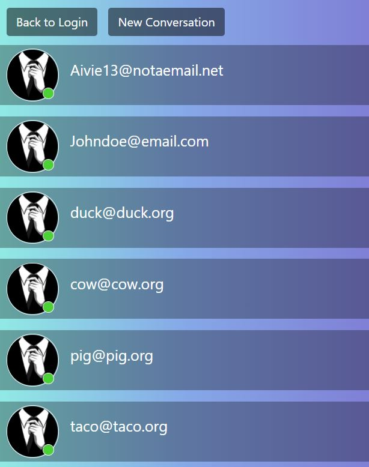
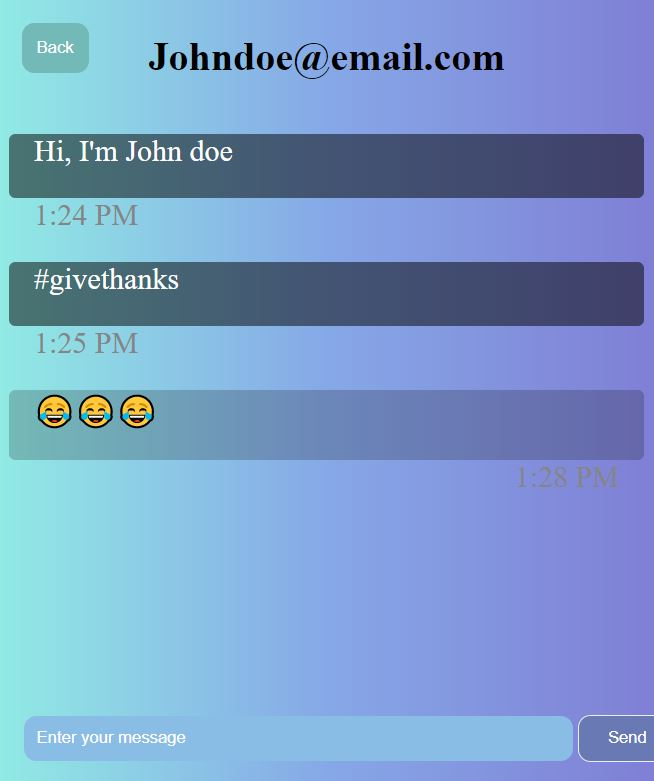

# MAWP-Messaging
* This is a web application that alows two people to comunicate to eachother over the internet. It consists of a login page, a conversations, page, and a messaging page. 
 
# Development Environment
* [Glitch](https://www.glitch.com/)
    * HMTL
    * JavaScript
    * CSS
* [Firebase](https://firebase.google.com/)

# Firebase Setup
1. create a google account and log into firebase.

2. Click on "Create a project" and follow the setup instructions. (Be sure to save the code it gives you, you will use it to access your firebase project.)

3. Once the prject is made, open it up and go to "Authentication" -> "Sign-in Method" and enable "Email/Password".

# Files
Files are orginised based on names to keep things clean and easy to understand. This is done by naming each file related to eachother with the same name.

* ## login.html, login.css, login.js
    > This page permits a specific persion access to their messaging data.   
    >
    > ### <u>HTML:</u>
    >    
    >   
    >   
    > ### <u>JavaScript Functions:</u>   
    > 1. getForm()   
    > { Retrevies and returns user email and pasword input. }
    >   
    > 2. login()   
    > { Submits users email and pasword into a firebase login function to access users data. If sucessfull, it will check to see if the remember me checkmark is active and save the credentials accordingly. Otherwise this function will return an error message. }
    >
    > 3. signup()   
    > { Submits users email and password into a firebase signup function to create a new user account. If sucessfull, it will log the user in automaticly. Otherwise this function will return an error message. }   
    >   
    > 4. checkForRememberMe()   
    > { Checks to see if local storage already contains something. }   
    >   
    > 5. forgotPassword()   
    > { Prompts the user for their email then submits it to an authoration function. If sucessfull, the user will recieve an email with a link that will allow them to change their password. Otherwise this function will return an error message. }

* ## conversations.html, conversations.css, conversations.js
    > This page lists all the conversations the user participates in.
    >   
    > ### <u>HTML:</u>   
    >
    >   
    > ### <u>JavaScript Functions</u>
    > 1. startConversation()   
    > { Prompts for a user email to message to and submits it into a firebase function. If sucessfull a new conversation will be created. Otherwise this function will return an error message. }
    >   
    > 2. loadConversations()   
    > { Retrevies existing conversations from the database and displays them on the webpage.}
    >   
    > 3. back()   
    > { Sends user back to log in page. }

* ## messages.html, messages.css, messages.js
    > This page displays the content of a chosen conversation.
    >   
    > ### <u>HTML:</u>
    >
    >   
    > ### <u>JavaScript Functions</u>
    > 1. loadMessages()   
    > { Constantly looks for content in the database to display on the webpage. }
    >   
    > 2. send()   
    > { retrieves the users input value from text box and submits it to a to the database under the given users email. }

# Helpfull Websites
* [w3schools HTML Tutorial](https://www.w3schools.com/html/default.asp)
* [w3schools JavaScript Tutorial](https://www.w3schools.com/js/default.asp)
* [Firebase Documentation](https://firebase.google.com/docs/)
